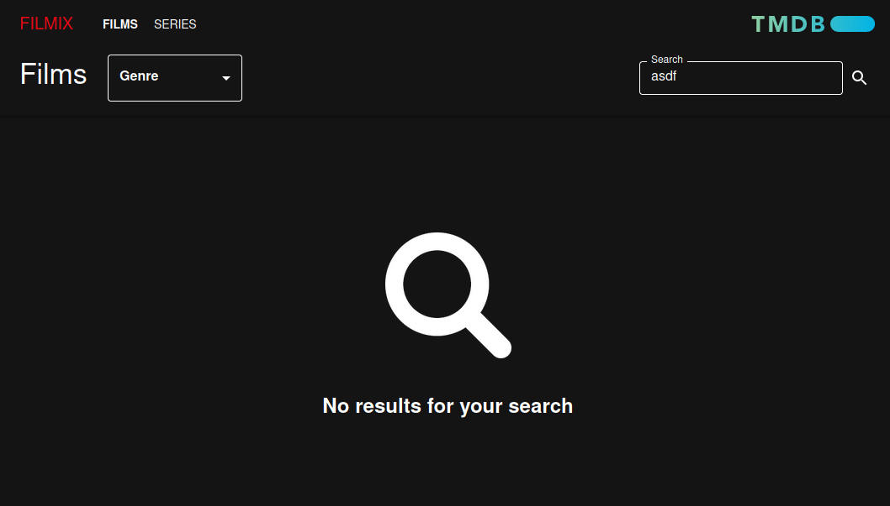

# Filmix (The Movie Database API frontend)

## About this project

### What is it?

A very simple web application, where you will be able to visually recover information about movies and TV series included in "The Movie Database API".

### Purpose

Created as a practice in the context of the [GeeksHubs Academy's Frontend React Developer](https://geekshubsacademy.com/producto/frontend-react/) Bootcamp.

## Overview

### Features briefing

This is what is included:

* **Display information about movies**. The most popular movies are displayed by default. Movies can be filtered by genre and by a search text. For each movie, its title, overview and poster is displayed.
* **Display information about series**. The most popular series are displayed by default. Movies can be filtered by genre and by a search text. For each movie, its title, overview and poster is displayed.
* **Available in English and Spanish**. Language is auto-detected from the browser.
* **Responsive**. An UI inspired by *Netflix*, the popular streaming service, designed with the aim to be responsive.

### Main dependencies

In this section the main dependencies of this project are highlighted.

| Package                                                      | Purpose                                                      |
| ------------------------------------------------------------ | ------------------------------------------------------------ |
| [@mui/material](https://www.npmjs.com/package/@mui/material) | A library of *React UI* components used to build the interface. |
| [redux](https://www.npmjs.com/package/redux) [react-redux](https://www.npmjs.com/package/react-redux) | A library used to apply a pattern to manage the state of the application in a centralized way, instead of creating an individual state for each component. |
| [react-router-dom](https://www.npmjs.com/package/react-router-dom) | A routing library used to configure the navigation within the application without reloads |
| [i18next](https://www.npmjs.com/package/i18next) [i18next-browser-languagedetector](https://www.npmjs.com/package/i18next-browser-languagedetector) | A framework used for internationalization. This way the application can be displayed in Spanish or English, depending on the language detected in the browser. |
| [@testing-library/jest-dom](https://www.npmjs.com/package/@testing-library/jest-dom) [@testing-library/react](https://www.npmjs.com/package/@testing-library/react) [@testing-library/user-event](https://www.npmjs.com/package/@testing-library/user-event) [jest-axe](https://www.npmjs.com/package/jest-axe)  | A set of libraries to facilitate components testing. In the project some unit tests, integration tests and tests to check accessibility can be found. |
| [react-intersection-observer](https://www.npmjs.com/package/react-intersection-observer) | A library that simplifies the management of Intersection Observer. It is required to detect when a user has reached the end of the page (which triggers the automatic load of a new page of results). |
|                                                              |                                                              |

### How the application looks

Follow these steps to test the application:

1. The home path is loading by default the movies tab. This is what is displayed by accessing "/" or "/movie" paths:

   

2. In order to acccess to TV series information, it is required to click on the *Series* tab, located at the top left of the header. This will route the application to "/tv".

   

3. Movies and TV series are displayed in the same way, so further descriptions can be applied to both views. There are two different options to search for items, both included in the header. The first option consist of selecting a specific genre. It should be highlighted that genres for movies and TV series are different.

   

4. The other option is to filter by a specific search text, by typing the text in the input to the right. The match is tried against (original and translated) title and overview. It should be noted that it is not possible to apply both filters at the same time (this is a limitation of *TMDB* api), so if one filter is applied, the other is reset.

   

5. When a search is applied, the user is properly prompted in case that there are no results for the specific search text.

   

6. When the view is initiated or when a search is applied, a skeleton-like loading state is properly prompted to let the user know that results are being recovered.

   

7. Pagination is triggered depending on the scroll. The next page is recovered and displayed automatically when the pagination text (at the bottom) is visible on the screen. Once the second page is visible, a "back to the top" button appears at the bottom right.

   

8. This is how it looks automatic pagination.

   

9. Regarding movies and TV series cards, they are highlighted on hover. Once clicked, a sidebar panel is opened to show more details.

   

## Implementation details

### Movies vs TV Series items

As the same information is expected for movies and TV series, a single and general component called *ItemsView* has been developed. This way, by providing just a props tag to specify the nature of the item (if it is a movie or a series) it works properly for both. Likewise, this approach is applied to the api wrapper, through which calls are made to *TMDB* api. General functions are exposed and adequate results are returned by only providing the item tag.

### API calls

For a quick overview on the subset of *TMDB* api endpoints involved to develop this application, check `src/const/moviesApi.js`. For further details, check the wrapper at `src/services/wrappers/moviesApi.js`

### Why redux?

Even if a set of components have been required to develop this viewer, all them can be considered as subcomponents that provide a single core component. Let's considerate the following:

* The search options, as well as the visible tab (movies or TV series), are all together within the *Header* component. So this is the component which really controls which results should be displayed.
* The *ItemsBoard* component is responsible for displaying the results, but it is decoupled from the applied filters. It is focused on rendering.

This is why *Header* and *ItemsBoard* (and their subcomponents) are really acting like parts of the same component and both should work together. With this scenario, it makes sense to use a common state, updatable and accessible from all these separated components.

### Testing

With the help of the [testing library](https://testing-library.com/), a set of unit tests has been added to the project. They have a mixed nature and can be considered as integration tests too, as almost all the information rendered is dependent on the information recovered from *TMDB* api.

All tests are meant to test the application as a whole, because, as explained in prior sections, all components are in fact subcomponentes required to build the viewer. That's why it is not possible to develop individual tests for each component separately.

Additionally, [jest-axe](https://github.com/nickcolley/jest-axe) has been used in order to apply a basic accessibility check to all components.

The most distinctive aspects of the tests at the implementation level are the following:

* The intersection observer requires to be mocked. If not, the intersection will be detected always and only once when component is rendered.
* Functions included in the api wrapper require to be mocked, to always have a predictable fake response when the test executes requests.
* As redux is applied, a store should be provided for each test. Instead of standard render function, a custom *renderWithProviders* function is used to render the required component within the test.
* The *useNavigate* hook from the *react-router* should be mocked too, as tests are not executed in a browser environment. Similarly, the *window.scrollTo* function has to be mocked.

## How to execute

### Local environment

##### Start the application

After downloading this repository, go to `src/const/moviesApi.js` and look for the following constant `API_KEY`. Its value should be replaced with your own generated API key. It can be obtained [here](https://www.themoviedb.org/settings/api).

Once the previous configuration has been changed, in the project directory you can run: `npm start`

This will run the application in the development mode. Open [http://localhost:3000](http://localhost:3000) to view it in your browser.

##### Test the application

3 sets of test are available (a total of 18 tests) for testing movies, TV series and accessibility. To run the test, execute: `npm test`

### Deployed version

This project has been deployed with the help of *Heroku* and is accessible here:

#### `https://laura-filmix.herokuapp.com/`

